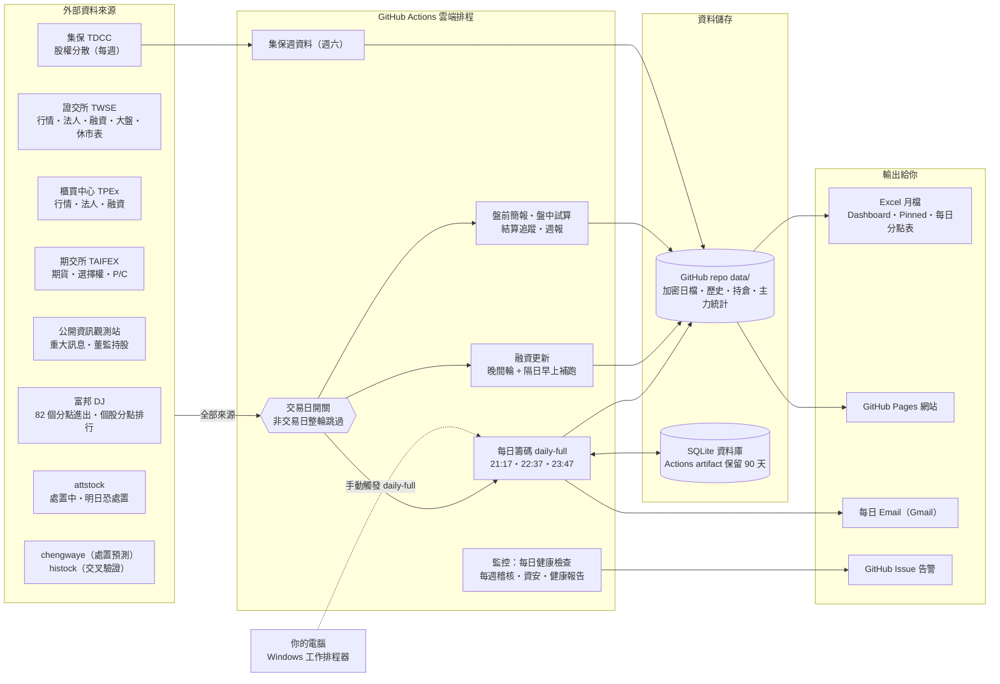
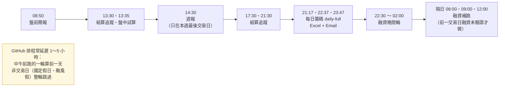
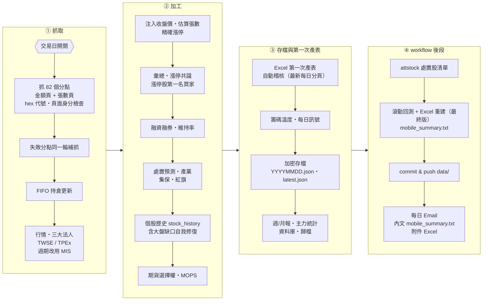
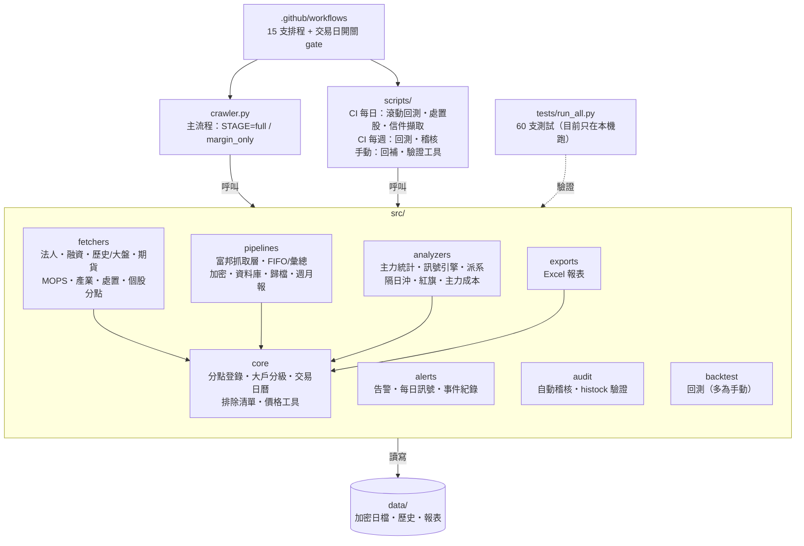

# Chip Radar TW — 系統圖・流程圖・架構圖

> 依 2026-10-06 對 repo 的完整盤點（v3.80.14）繪製。圖檔在 `docs/diagrams/`；
> 每張圖的 Mermaid 原始碼放在圖下方的展開區塊，GitHub 會直接畫出來。
> **修改流程或程式結構時，原始碼與圖檔要一起更新**（圖檔由同一份原始碼渲染）。

| 圖 | 回答的問題 |
|---|---|
| 1. 系統圖 | 資料從哪來、在哪裡跑、存在哪裡、最後給你什麼 |
| 2-1. 流程圖（一個交易日） | 每天幾點跑什麼，非交易日怎麼處理 |
| 2-2. 流程圖（每日籌碼內部） | 每日籌碼 daily-full 一輪裡面依序做哪些事 |
| 3. 架構圖 | 程式碼怎麼分工、誰呼叫誰 |

## 1. 系統圖 — 資料從哪來、在哪跑、存哪裡、給誰

Mermaid 原始碼

## 2-1. 流程圖 — 一個交易日的時間軸（每一輪都先過交易日開關）

Mermaid 原始碼

## 2-2. 流程圖 — 每日籌碼 daily-full 內部步驟

Mermaid 原始碼

## 3. 架構圖 — 程式怎麼分工

Mermaid 原始碼

## 附：盤點時發現、尚未處理的事項

| 事項 | 狀態 | 依據 |
|---|---|---|
| 主力貢獻度 `data/master_contribution.json` 停在 2026-08-29 | 已確認，未處理 | 檔內 updated_at；每日滾動更新會執行它，推測一直失敗 |
| 測試只在本機跑，沒有任何雲端排程執行 `tests/run_all.py` | 已確認，未處理 | 15 支 workflow 都沒有呼叫 |
| 結算追蹤的時間窗檢查可能永遠提早結束 | 推測，未驗證 | `settlement-tracking.yml` 的 python -c 沒有先 import src |
| Excel 月檔是明碼、放在公開 repo | 使用者 2026-10-06 確認可供下載 | — |
