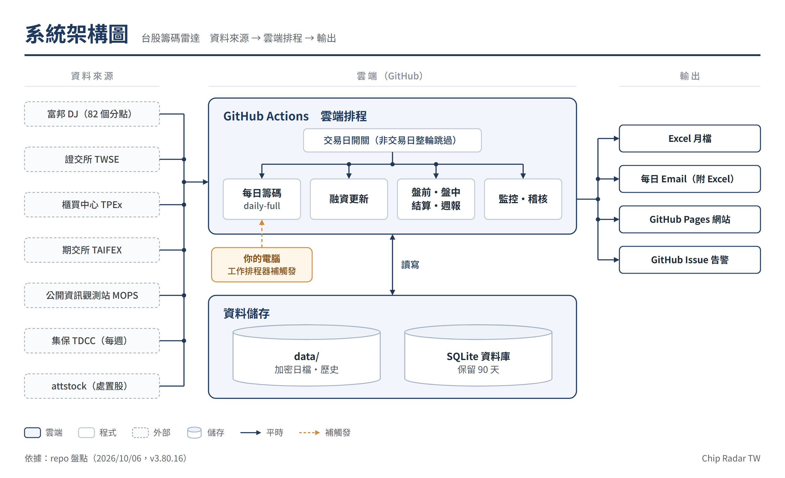
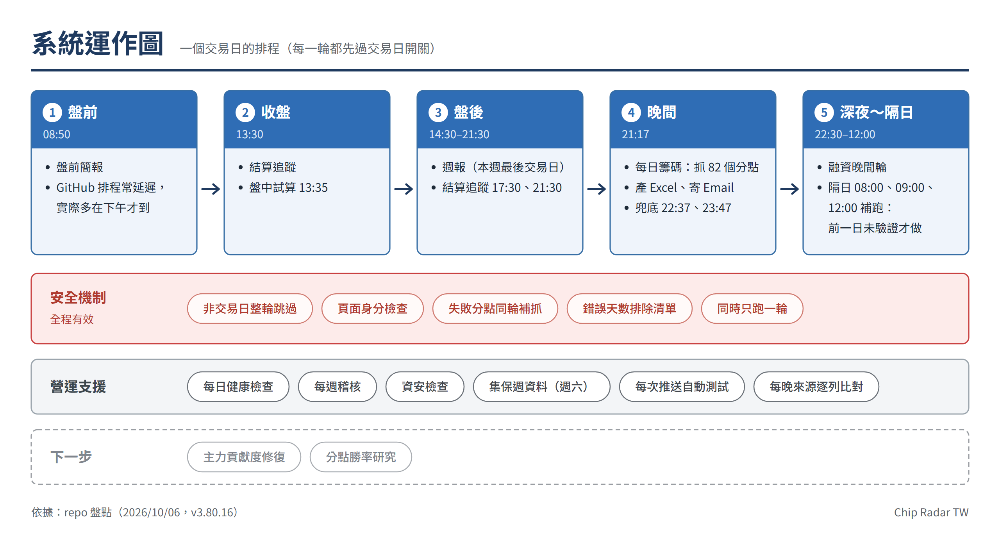
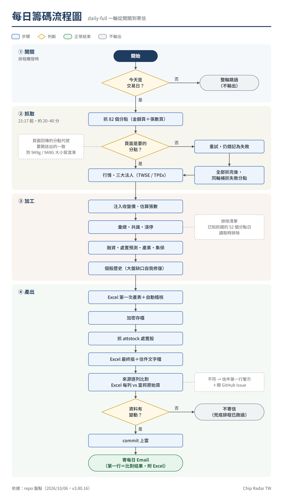
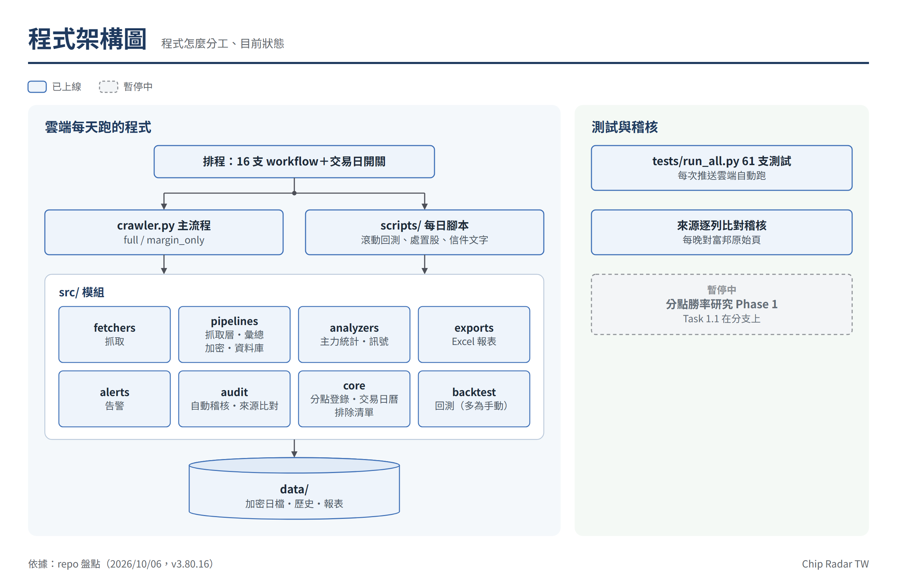

# Chip Radar TW — 系統圖・流程圖・架構圖

> 依 2026-10-06 對 repo 的盤點繪製（v3.80.16）。圖檔在 `docs/diagrams/`（PNG＋SVG）。
> 版面仿使用者其他專案的手繪風格，由 `docs/diagrams/build_diagrams.py` 逐一排版後用 Chrome 渲染：
> **修改流程或程式結構時，改 `build_diagrams.py` 裡的內容再重跑**（`python docs/diagrams/build_diagrams.py`），
> 不要直接改 PNG。腳本會自動檢查文字是否超出框、線是否穿過框、線有沒有交叉。

| 圖 | 回答的問題 |
|---|---|
| 1. 系統架構圖 | 資料從哪來、在哪裡跑、存在哪裡、最後給你什麼 |
| 2. 系統運作圖 | 一個交易日幾點跑什麼；全程有效的安全機制；營運支援；下一步 |
| 3. 每日籌碼流程圖 | 每日籌碼 daily-full 一輪，從交易日開關到寄信依序做哪些事 |
| 4. 程式架構圖 | 程式碼怎麼分工、測試與稽核目前的狀態 |

## 1. 系統架構圖

- 7 個外部來源全部進 GitHub Actions；每一輪排程先過「交易日開關」，非交易日整輪跳過。
- 資料存在 repo 的 `data/`（加密日檔）與 SQLite 資料庫（Actions artifact，保留 90 天）。
- 輸出：Excel 月檔、每日 Email（附 Excel）、GitHub Pages 網站、GitHub Issue 告警。
- 你的電腦（工作排程器）只做補觸發，不是必要元件。

## 2. 系統運作圖 — 一個交易日

- GitHub 排程常延遲：中午前跑的一輪算前一個交易日；盤前簡報實際多在下午才到。
- 晚間每日籌碼 21:17，兜底 22:37、23:47；融資隔日 08:00、09:00、12:00 補跑（前一日未驗證才做）。

## 3. 每日籌碼流程圖 — daily-full 一輪

- 頁面身分檢查：富邦頁面回傳的分點代號要跟送出的一致，否則重試、仍錯記失敗，全部抓完後同輪補抓。
- 來源逐列比對（v3.80.15）：Excel 最新日表每一列對富邦指定日期原始頁＋官方收盤價；結果寫在信件第一行，不符時開 GitHub Issue。
- 資料沒有變動（兜底排程已跑過）就不 commit、不寄信。

## 4. 程式架構圖

- 排程（16 支 workflow）呼叫 `crawler.py` 主流程與 `scripts/` 每日腳本，兩者都用 `src/` 的 8 個模組，讀寫 `data/`。
- `tests/run_all.py`（61 支）每次推送程式碼都在雲端自動跑（`.github/workflows/tests.yml`）。
- 分點勝率研究 Phase 1 暫停中（Task 1.1 在 `winrate-phase1` 分支）。

## 附：盤點時發現的事項

| 事項 | 狀態 | 依據 |
|---|---|---|
| 主力貢獻度 `data/master_contribution.json` 停在 2026-08-29 | 已確認，下一個處理 | 檔內 updated_at；每日滾動更新會執行它，推測一直失敗 |
| 測試只在本機跑 | 已處理（v3.80.15） | `.github/workflows/tests.yml` |
| Excel 只做表面稽核，沒有對原始來源 | 已處理（v3.80.15） | `src/audit/source_audit.py` |
| Pinned 頁「買張」永遠 0、「連續囤貨」永遠無資料 | 已處理（v3.80.16） | 讀錯欄位 / 讀錯格式；連續囤貨表依使用者指示移除 |
| 結算追蹤的時間窗檢查可能永遠提早結束 | 推測，未驗證 | `settlement-tracking.yml` 的 python -c 沒有先 import src |
| Excel 月檔是明碼、放在公開 repo | 使用者 2026-10-06 確認可供下載 | — |
